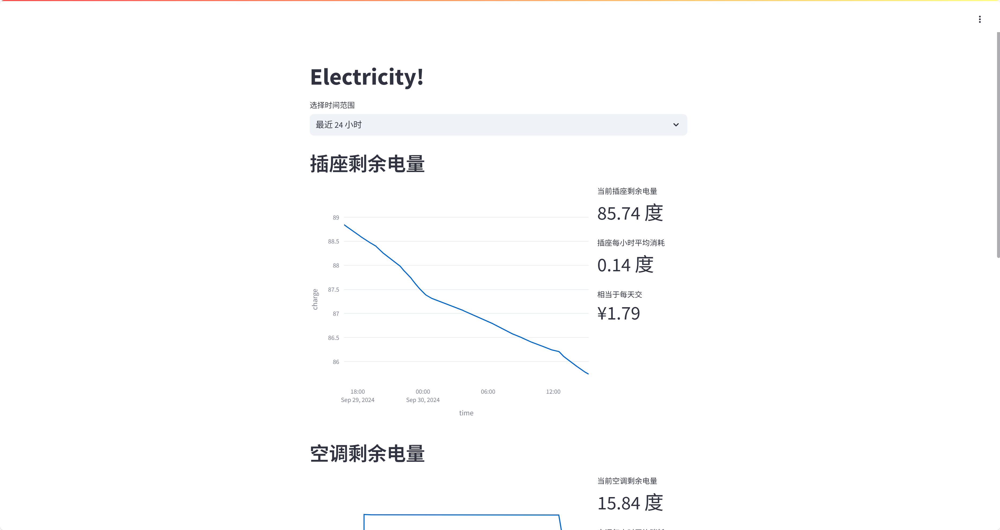

# OUC Electricity Monitor

一个监控电费变化的工具，实现了电量余量监控、可视化和通知。原始实现源于 [白佬](https://github.com/3401797899)。

## 预览



## 使用

首先，请确保您的 Python 版本为 3.8 及以上。创建虚拟环境：

```bash
python -m venv .venv
```

激活虚拟环境：

```bash
# Windows CMD
.venv\Scripts\activate.bat

# Windows PowerShell
.venv\Scripts\Activate.ps1

# macOS and Linux
source .venv/bin/activate
```

接着，根据 `requirements.txt` 安装依赖：

```bash
pip install -r requirements.txt
```

请保证已连接到校园网，然后编辑 `config.toml` 文件，填入学号和数据库信息。

> [!NOTE]
> 如果对数据库使用不熟悉，建议使用 SQLite 并填写 `file_path`（如 `Electricity.db`），程序会自动创建数据库文件。

```toml
[database]
type = "SQLite" # 数据库类型，支持 SQLite 和 MySQL

[notify]
chazuo_threshold = 10
kongtiao_threshold = 10

[student]
id = "your_student_id"
electricity_fee = 0.54

[visualize]
title = "Electricity!"

[database.MySQL]
host = "localhost"
port = 3306
user = "your_username"
password = "your_password"
database_name = "your_database_name"

[database.SQLite]
file_path = "your_database_file_path"

[notify.bark]
# https://bark.day.app/
enabled = false
device_token = "your_device_token"
```

其中，electricity_fee 为电费单价，单位为元/度。0.54 为财务处公布的电费单价。

`chazuo_threshold` 和 `kongtiao_threshold` 为电量余量阈值，当电量余量低于阈值时会发送通知。对于 iOS 用户，如果需要推送通知，请填写 `bark` 配置项，`device_token` 为 Bark 的设备码。关于 Bark 的更多信息请参考 [Bark 官网](https://bark.day.app/) 或 [Bark GitHub](https://github.com/Finb/Bark)。


配置完成后，初始化数据库：

```bash
python init.py
```

初始化过程中程序会判断是否有多个空调终端，如果有则会提示选择一个，请注意选择自己的空调终端。如果选错了，可以再次运行 `init.py` 重新选择。如果运行顺利，在 `config.toml` 中会显示当前电费终端的信息。

接下来配置定时任务，可以使用 `crontab` 或者 Windows 任务计划程序。例如，每 10 分钟执行一次：

```bash
*/10 * * * * python get.py
```

最后运行 `visualize.py` 可以启动一个本地服务器，用于查看电费变化情况。

```bash
streamlit run visualize.py
```

## 注意

- 请勿将配置文件上传至公开仓库，其中包含了个人信息。
- 请勿频繁请求电费数据，以免对校园网造成影响。
- 对于电量的平均消耗计算依赖于定时任务的执行频率，如果定时任务执行频率不稳定，可能会导致电量的平均消耗不准确。计算时，只针对电量减少的情况进行计算，不考虑电量增加或不变的情况。因此每日电费估计**一定**是一个**偏大**的值，仅供参考。
